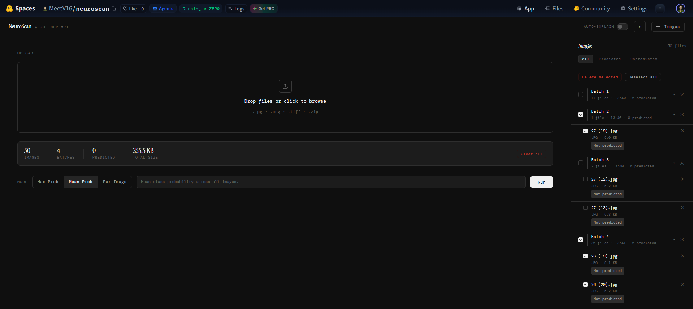
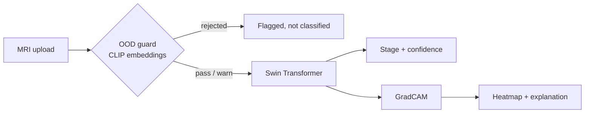

# NeuroScan

Feed it a brain MRI slice, get back an Alzheimer's stage and a heatmap of exactly what convinced it.

[](LICENSE) [](https://github.com/MeetRVyas/adni_app/commits/main) [](https://github.com/MeetRVyas/adni_app/actions/workflows/deploy_hf.yml) [](https://huggingface.co/spaces/MeetV16/neuroscan) [](https://github.com/MeetRVyas/adni_code)

## Why this exists

This started as the inference slice of a bigger medical imaging pipeline. The model itself went through a few rounds of architecture search before finalizing Swin.

## Try it

Live: **[huggingface.co/spaces/MeetV16/neuroscan](https://huggingface.co/spaces/MeetV16/neuroscan)**



## Features

- Classifies brain MRI slices into four Alzheimer's stages with a fine-tuned Swin Transformer (`swin_base_patch4_window7_224`, ~86M parameters, pretrained on ImageNet-22k)
- Explains every prediction with a GradCAM implementation built from scratch, hooks and all, no `pytorch-grad-cam` dependency
- Rejects non-MRI uploads before they reach the classifier, using CLIP embeddings checked against calibrated training centroids and a zero-shot prompt set
- Takes single images, batches, or zipped folders in one request, with per-image, max-probability, or mean-probability aggregation
- Trained with a progressive unfreezing schedule (5 phases in the current model, tuned from a variable-phase search), SAM in the later phases, and Focal Loss with inverse-frequency class weights, since `ModerateDemented` is roughly 1% of the dataset
- Auto-deploys to the Hugging Face Space above on every relevant push, via GitHub Actions

## Quick start

```bash
git clone https://github.com/MeetRVyas/adni_app.git
cd adni_app
pip install -r requirements.txt
uvicorn main:app --host 0.0.0.0 --port 7860
```

Needs trained weights at `output/saved_models/swin_progressive_best.pth`. Train your own with `train_swin.py`, or just use the live Space above. For the broader experimentation behind this model (other architectures, other class-weighting methods), see [adni_code](https://github.com/MeetRVyas/adni_code).

## How it works

An out-of-distribution guard runs first: CLIP embeddings get checked against calibrated training centroids and a zero-shot "is this a brain MRI" prompt set, so uploads that clearly aren't MRIs get flagged instead of confidently misclassified. Anything that passes goes to the Swin classifier, then a hand-rolled GradCAM pass highlights the region that drove the call.



`POST /predict`, `POST /explain`, `GET /health`, and a few more. See `main.py` for the full list.

## Tech stack

PyTorch, timm, FastAPI, Docker, Hugging Face Spaces (ZeroGPU), CLIP via `transformers`.

## Status

Deployed and running as the live demo above. No fixed roadmap, it grows when something interesting comes up.

## References

- Liu et al., [Swin Transformer: Hierarchical Vision Transformer using Shifted Windows](https://arxiv.org/abs/2103.14030), ICCV 2021
- Selvaraju et al., [Grad-CAM: Visual Explanations from Deep Networks via Gradient-Based Localization](https://arxiv.org/abs/1610.02391), ICCV 2017
- Foret et al., [Sharpness-Aware Minimization for Efficiently Improving Generalization](https://arxiv.org/abs/2010.01412), ICLR 2021
- Lin et al., [Focal Loss for Dense Object Detection](https://arxiv.org/abs/1708.02002), ICCV 2017
- Radford et al., [Learning Transferable Visual Models From Natural Language Supervision](https://arxiv.org/abs/2103.00020) (CLIP), ICML 2021

## Contributing

Issues and PRs welcome.

## License

MIT, see [LICENSE](LICENSE).